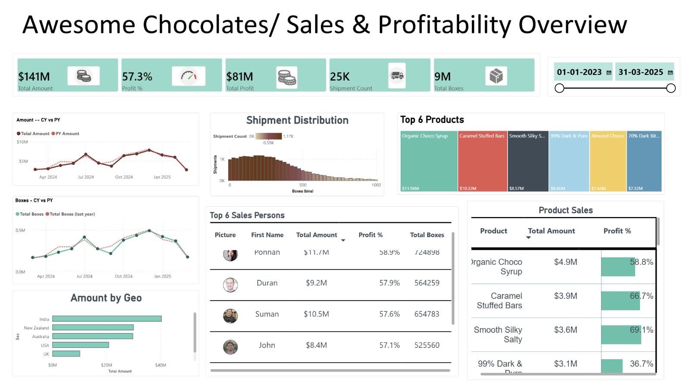

# Awesome Chocolates — Sales & Profitability Dashboard

A Power BI report built end-to-end while working through [Chandoo.org's Power BI full course](https://chandoo.org/). Sample dataset (`Awesome Chocolates`), covering shipments from Jan 2023 – Mar 2025.



---

## Contents

```
choco-analysis-powerbi/
├── Choco analysis.pbix          # Power BI Desktop file
├── bibg.json               # Custom report theme
├── screenshots/
│   └── dashboard.png
└── README.md
```

Open the `.pbix` in Power BI Desktop (free). Apply the theme via **View → Themes → Browse for themes → `bibg.json`**.

---

## The report

A single-page executive dashboard with five sections:

| Section | Visual | Question it answers |
|---|---|---|
| KPI strip | Card (new card visual) | What are the headline numbers? |
| Trend | Two line charts, CY vs PY | Are we growing or shrinking year over year? |
| Geography | Sorted bar chart | Where does revenue come from? |
| Shipment distribution | Histogram (binned column chart) | What size orders do we actually ship? |
| Rankings | Two tables + treemap | Who and what drives the business? |

A date-range slicer controls the page, with **Edit interactions** deliberately disabled on the two CY-vs-PY charts so they stay locked to a fixed 13-month comparison window regardless of slicer state.

## Data model

Five tables in a **star schema**:

```
                  calendar
                     │
   locations ──── shipments ──── products
                     │
                   people
```

- **`shipments`** is the fact table (~25,000 rows, one row per shipment)
- **`calendar`**, **`locations`**, **`products`**, **`people`** are dimension tables

Relationships are one-to-many from each dimension to the fact, with filter propagation flowing dimension → fact.

**`calendar` is marked as a date table** (Table view → right-click `calendar` → Mark as date table → `date table`). This is not optional — time-intelligence functions like `SAMEPERIODLASTYEAR` return incorrect results without it.

---

## Power Query transformations

Three things happen before the data reaches the model:

**1. Cost column (merge + arithmetic)**

`shipments` has `Boxes` and `Amount` but no cost. `products` has `Cost_per_box`. To get profit, cost has to exist at the shipment grain:

- Merge `shipments` with `products` on `PID` (left outer join)
- Expand only `Cost_per_box`
- Select `Boxes` and `Cost_per_box` → Add Column → Standard → Multiply
- Rename the result to `Cost`, drop `Cost_per_box`

Doing this in Power Query rather than DAX matters: it's a one-time load operation instead of a per-query calculation.

**2. `Start of Month` column**

Added to `calendar` via Add Column → Date → Month → Start of Month. Collapses every date in a month to a single value, which lets a monthly trend chart use one axis field instead of stacking Year + Month.

**3. `First Name` column**

Added to `people` via Add Column → Extract → Text Before Delimiter (space). Full names were too wide for the rankings table.

---

## DAX measures

### Base measures

```dax
Total Amount = SUM(shipments[Amount])

Total Cost = SUM(shipments[Cost])

Total Boxes = SUM(shipments[Boxes])

Shipment Count = COUNTROWS(shipments)
```

`COUNTROWS` is the right tool here because one row = one shipment. The measure itself contains no filtering logic — the filter context arrives from whatever dimensions the visual puts on it, propagated through the relationships.

### Composite measures

```dax
Total Profit = [Total Amount] - [Total Cost]

Profit % = DIVIDE([Total Profit], [Total Amount])

Amount per Box = DIVIDE([Total Amount], [Total Boxes])
```

`DIVIDE` instead of the `/` operator. When a slicer narrows the data far enough that the denominator hits zero or blank — a specific salesperson in a country they never shipped to — `/` throws an error and `DIVIDE` returns blank. Blank can then be excluded from conditional formatting; an error can't.

### Time intelligence

```dax
PY Amount =
CALCULATE(
    [Total Amount],
    SAMEPERIODLASTYEAR(calendar[cal_date])
)

Total Boxes PY =
CALCULATE(
    [Total Boxes],
    SAMEPERIODLASTYEAR(calendar[cal_date])
)
```

`CALCULATE` evaluates an expression under a modified filter context. `SAMEPERIODLASTYEAR` shifts the date context back exactly one year. Together: "compute Total Amount, but as of twelve months ago."

### Variance with blank handling

```dax
Amount Variance =
VAR TA_LY = [PY Amount]
RETURN
    IF(
        ISBLANK(TA_LY),
        BLANK(),
        [Total Amount] - TA_LY
    )
```

Without the `ISBLANK` guard, the first twelve months of data show a variance equal to the full current-year value — because Power BI treats the blank prior-year figure as zero and subtracts it. That reads as a catastrophic year-over-year collapse when the truth is simply that no prior-year data exists yet.

`VAR` / `RETURN` also means `[PY Amount]` is evaluated once instead of twice.

---

## Report-building techniques used

### Sort by column
`month_name` sorts alphabetically by default — April, August, December, February. Fixed via Column tools → **Sort by column** → `Month_num`. Applies globally: every visual, slicer, and axis using `month_name` inherits the correct chronological order.

### Binning (grouping)
The shipment distribution histogram plots ~1,000 distinct box counts, which is unreadable. Right-click `Boxes` → **New group** → bin size 25. Creates a `Boxes (bins)` column that buckets shipments into 25-box ranges.

### Top N filters
Rankings tables use **Filter pane → Filter type: Top N → Top 6 by Total Amount**. This is dynamic: click a month in another visual and the Top 6 recalculates for that month.

### Filter pane vs. slicers
Both filter. The difference is screen real estate and intent:
- **Slicer** — a visible control the reader is meant to use
- **Filter pane** — a constraint applied without consuming canvas space

The 13-month window on the trend charts lives in the filter pane. The date range lives in a slicer.

### Edit interactions
Format ribbon → **Edit interactions**. Controls whether selecting in visual A filters, highlights, or ignores visual B.


### Conditional formatting — data bars
Cell elements → Data bars → `fx` (Advanced controls). Key settings:
- **Minimum / Maximum** must be set to `Custom` when the auto-scale hides differences. Six salespeople between 54% and 59% render as six identical bars on an auto scale.
- **Negative bar color** set separately from positive. Products at −35% profit need a red bar extending from a visible baseline, not an invisible sliver.
- Setting Maximum above the true max (e.g. `1.5` for a 0–1 range) keeps the bar from consuming the whole column and colliding with the number.


### Measure-based titles
The `fx` button next to a visual title accepts a measure. Write a measure that returns a sentence, bind it to the title, and the title recalculates as the reader interacts — turning a static label into a running narrative.

### Custom theme (JSON)
`Innovate.json` sets `dataColors`, `background`, `foreground`, and `tableAccent` globally. Applied via View → Themes → Browse for themes.

Important limitation: **any color set manually on a visual overrides the theme.** After importing a theme, hand-formatted visuals must be reset (Format pane → `...` → Reset to default) before they'll inherit it.

---

## Findings

> Fill this section in with your own verified numbers before publishing.

Spot-checked at May 2024:

| Metric | CY | PY | Δ |
|---|---|---|---|
| Amount | $3.88M | $4.88M | −20.5% |
| Boxes | 236,818 | 302,159 | −21.6% |

Revenue and volume move together, which points to a units problem rather than a pricing one. 
Product-level profitability is bimodal: the best products clear 90% margin while several run negative.


## Credits

Dataset:  Is uploaded in the files section. 

Built by [Lithika Jadav](https://github.com/lithikajmalothu-16).
